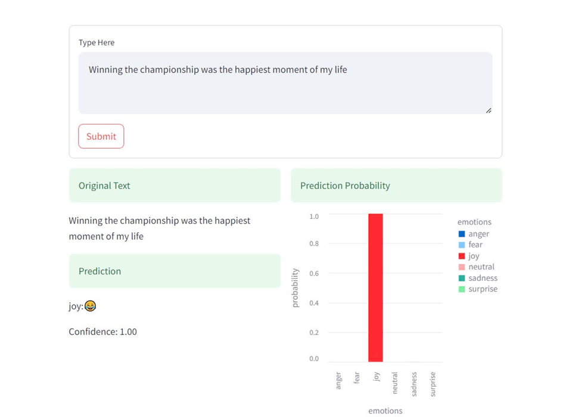

# Phân Tích Cảm Xúc Từ Văn Bản

## Giới Thiệu

Dự án sử dụng mô hình học sâu để phân loại cảm xúc của văn bản dựa trên các tập dữ liệu văn bản có gán nhãn.Nó sử dụng TensorFlow cho phần backend và Streamlit cho giao diện web thân thiện với người dùng. Các cảm xúc được phân loại bao gồm: **sadness**, **joy**, **neutral**, **anger**, **fear**, và **surprise**. Tập dữ liệu đầu vào chứa các câu văn đã được tiền xử lý và sử dụng mô hình LSTM (Long Short-Term Memory) với lớp Bidirectional để cải thiện hiệu quả phân loại.

## Cài Đặt và Yêu Cầu

Dự án này yêu cầu một số thư viện Python, bao gồm:

- `pandas`
- `numpy`
- `tensorflow`
- `nltk`
- `seaborn`
- `matplotlib`
- `scikit-learn`
- `streamlit`

Để cài đặt các thư viện này, bạn có thể sử dụng `pip`:

```bash
pip install pandas numpy tensorflow nltk seaborn matplotlib scikit-learn streamlit
```

## Cách Sử Dụng

1. **Tải xuống mô hình đã huấn luyện trước**:

    [ckpt4.h5](https://drive.google.com/file/d/1xxAUDZKJXLTaZFpatITFwQEzzO8kJAr-/view?usp=drive_link)   
    [tokenizer4.pickle](https://drive.google.com/file/d/1mpeKNoG7lJsxVebTyUw5r4rzV_rHBUNr/view?usp=drive_link)

2. **Chạy ứng dụng**:
```bash
streamlit run app.py
```
3. **Nhập văn bản**: Nhập vào một đoạn văn bản và kiểm tra kết quả phân loại cảm xúc.


## Phân Tích Dữ Liệu

Dữ liệu đã được tải từ Kaggle và tiền xử lý bao gồm:

- Loại bỏ các ký tự không cần thiết (chữ số, dấu câu, URL, v.v.).
- Thực hiện tách từ, loại bỏ từ dừng và từ viết tắt.
- Đưa văn bản về dạng chữ thường và loại bỏ các từ không có ý nghĩa.

## Mô Hình

Mô hình sử dụng mạng neuron học sâu với các thành phần sau:

- **Embedding Layer**: Để chuyển các từ thành các vector có chiều dài cố định.
- **Bidirectional LSTM**: LSTM hai chiều để cải thiện khả năng nắm bắt ngữ cảnh trong văn bản.
- **BatchNormalization**: Giúp ổn định và tăng tốc quá trình huấn luyện.
- **Dense Layer**: Để phân loại cảm xúc với đầu ra softmax.
- **Dropout**: Ngăn ngừa việc mô hình bị overfitting bằng cách bỏ qua một số trọng số trong quá trình huấn luyện.

## Đánh Giá và Kết Quả

Sau khi huấn luyện, mô hình cho độ chính xác cao trên dữ liệu kiểm thử. Các chỉ số đánh giá bao gồm:

- **Độ chính xác (Accuracy)**: Tỉ lệ phân loại đúng của mô hình.
- **Ma trận nhầm lẫn (Confusion Matrix)**: Để kiểm tra các dự đoán đúng và sai giữa các lớp cảm xúc.

